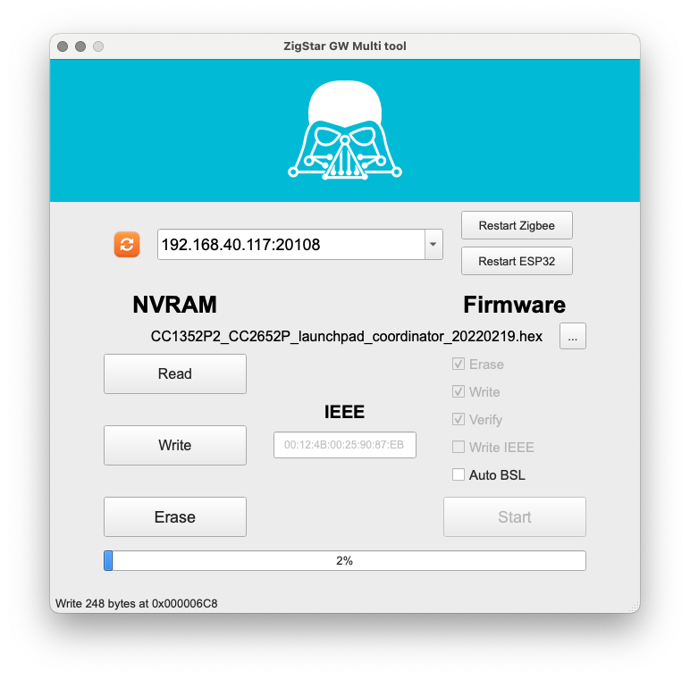

# cod.m ZigBee CC2652P2 TCP Coordinator
Initiated by Matthias' video to build a [ZigBee Coordinator with Ethernet connectivity](https://www.youtube.com/watch?v=Uz26JzOJVTc) we developed a small PCB to integrate everything in a small form factor - ready to go if you like.

The coordinator uses an CC2652P2 together with an [USR-K6](https://www.pusr.com/products/low-cost-ttl-to-ethernet-modules-usr-k6.html) serial ethernet gateway. The CC2652P2 is the current ZigBee implementation from Texas Intruments and supports ZigBee 3.x. The Z-Stack firmware is actively developed - much thanks to @koenkk again.

Should be usable with any Home Automation System that let's you use a TCP port instead of a local port. The module is tested with [io.broker](https://www.iobroker.net/) and [zigbee2mqtt](https://www.zigbee2mqtt.io/).

You can buy it at our webshop: https://shop.codm.de/automation/zigbee/40/zigbee-cc2652p2-tcp-ethernet-coordinator. It comes preconfigured with DHCP enabled, case and antenna.


To build a serial bridge the USR-K6 from USR IOT comes into play which implements everything needed to act as an TCP Server with a webinterface and in a small form factor.

You can find the files to 3d print the case on printables:
https://www.printables.com/de/model/179517-codm-cc2652p2-tcp-zigbee-coordiantor-case

## Configuration
If your home automation system let's you configure `TI ZStack/CCxxxx` devices as ZigBee coordinator over a TCP connection, you should be good to go. 

### io.broker
Install the zigbee adapter and configure the portname to `tcp://<ip-of-cc2652p-tcp>:20108` and choose `TI ZStack/CCxxxx` under type. After restarting the adapter everything should work. Check the logs for details like

```
Coordinator firmware version: {"type":"zStack3x0","meta":{"transportrev":2,"product":1,"majorrel":2,"mino rrel":7,"maintrel":1,"revision":20220103}}
```

### zigbee2mqtt
In `data/configuration.yaml` use the tcp connection under port in the section serial like so (including single quotes): 
```
serial: 
  port: 'tcp://<ip-of-cc2652p-tcp>:20108'
```

### USR-K6
If you factory reset the USR-K6 you'll need to configure the serial bridge again (see image). It act's as a TCP-Server on the given port.

The default IP of the USR-K6 is `192.168.0.7` and username/password for the webinterface is `admin/admin`.


## Update
You can update the Z-Stack firmware on the CC2652P2 module via network using [ZigStar's stunning ZigStar MultiTool](https://zig-star.com/radio-docs/zigstar-multi-tool/).

Find the Z-Stack Firmware in [Koenkks Z-Stack Firmware Repository]([https://github.com/Koenkk/Z-Stack-firmware/tree/master/coordinator/Z-Stack_3.x.0/bin](https://github.com/Koenkk/Z-Stack-firmware/releases)) and check the table for which file use for the __cod.m ZigBee CC2652P2 TCP Coordinator__. Usually this is `CC1352P2_CC2652P_launchpad_*.zip`.

Open up the case and bring the CC2652P2 in bootloader mode by holding FLASH, pressing RESET and then release FLASH. After that choose the settings in the MultiTool according to the screenshot and of course use the IP of _your_ CC2652P TCP Coordinator:



After that powercycle the module and use again.

Flashing via JTAG is also possible through the corresponding header.

# Thanks
* @klein0r Inital Idea - https://haus-automatisierung.com/
* @koenkk Z-Stack Firmware - https://github.com/Koenkk/Z-Stack-firmware
* @xyzroe ZigStar MultiTool - https://github.com/xyzroe/ZigStarGW-MT

# License
[CC-BY-NC-SA 4.0](https://creativecommons.org/licenses/by-nc-sa/4.0/)

[![CC BY-NC-SA 4.0][cc-by-nc-sa-image]][cc-by-nc-sa]

[cc-by-nc-sa]: http://creativecommons.org/licenses/by-nc-sa/4.0/
[cc-by-nc-sa-image]: https://licensebuttons.net/l/by-nc-sa/4.0/88x31.png

cod.m GmbH, Patrik Mayer, 2022
