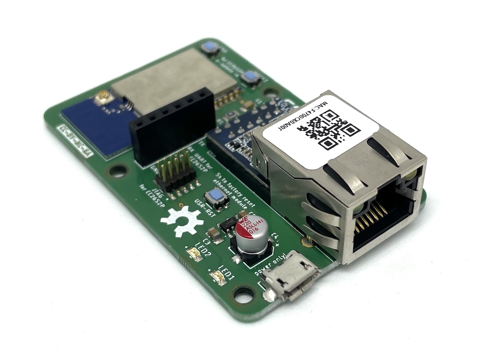
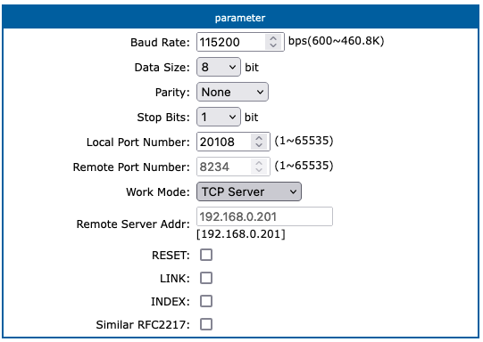

# cod.m ZigBee CC2652P2 TCP Coordinator
Initiated by Matthias' video to build a [ZigBee Coordinator with Ethernet connectivity](https://www.youtube.com/watch?v=Uz26JzOJVTc) we developed a small PCB to integrate everything in a small form factor - ready to go if you like.

The coordinator uses an CC2652P2 together with an [USR-K6](https://www.pusr.com/products/low-cost-ttl-to-ethernet-modules-usr-k6.html) serial ethernet gateway. The CC2652P2 is the current ZigBee implementation from Texas Intruments and supports ZigBee 3.x. The Z-Stack firmware is actively developed - much thanks to @koenkk again.

Should be usable with any Home Automation System that let's you use a TCP port instead of a local port. The module is tested with [io.broker](https://www.iobroker.net/) and [zigbee2mqtt](https://www.zigbee2mqtt.io/).

You can buy it at our webshop: https://shop.codm.de/automation/zigbee/40/zigbee-cc2652p2-tcp-ethernet-coordinator. It comes preconfigured with DHCP enabled, case and antenna.



To build a serial bridge the USR-K6 from USR IOT comes into play which implements everything needed to act as an TCP Server with a webinterface and in a small form factor.

You can find the files to 3d print the case on printables:
https://www.printables.com/de/model/179517-codm-cc2652p2-tcp-zigbee-coordiantor-case

## Configuration
If your home automation system let's you configure `TI ZStack/CCxxxx` devices as ZigBee coordinator over a TCP connection, you should be good to go. 

### io.broker
Install the zigbee adapter and configure the portname to `tcp://<ip-of-cc2652p-tcp>:20108` and choose `TI ZStack/CCxxxx` under type. After restarting the adapter everything should work. Check the logs for details like

```
Coordinator firmware version: {"type":"zStack3x0","meta":{"transportrev":2,"product":1,"majorrel":2,"mino rrel":7,"maintrel":1,"revision":20220103}}
```

### zigbee2mqtt
In `data/configuration.yaml` use the tcp connection under port in the section serial like so (including single quotes): 
```
serial: 
  port: 'tcp://<ip-of-cc2652p-tcp>:20108'
```

### ZHA integration in Home Assistant

From the Home Assistant front page go to Configuration and then select Integrations from the list. Use the plus button in the bottom right to add a new integration called ZHA to install the [ZHA (Zigbee Home Automation) integration](https://www.home-assistant.io/integrations/zha/).

In the popup:

* Serial Device Path - List of detected serial ports locally on the system (you will not use one of those). 
* Press Submit and the integration will try to detect radio type automatically. If unsuccessful, you will get a new pop-up asking for a radio type. In the pop-up:
* Select `znp` as Radio Type (which is for all Texas Instruments Zigbee based radions, including CC26x2 and CC13x2)
* Press `Submit` to save radio type and you will get a new form asking for port settings specific for this radio type. In the pop-up:
  * Serial device path - Manually enter `socket://ip-of-cc2652p-tcp:20108`
  * port speed (baud rate not applicable for all radios) - Enter `115200`
  * data flow control (not applicable for all radios) - Enter `sw` (for software flow control)

### USR-K6
If you factory reset the USR-K6 you'll need to configure the serial bridge again (see image). It act's as a TCP-Server on the given port.

The default IP of the USR-K6 is `192.168.0.7` and username/password for the webinterface is `admin/admin`.



## Update
To update the CC2652P2 module on the PCB you'll need an USB-UART adapter with the common FTDI pinout. Make sure it is 3.3V adaptor as 5V _will_ damage the module.

Plug it on the corresponding header on the PCB and bring the CC2652P2 in bootloader mode by holding FLASH, pressing RESET and then release FLASH.
Afterwards it is the same as "any normal" serial connected zigbee module. See https://github.com/codm/cc2652-raspberry-pi-module#serial-via-gpio

After that powercycle the module and use again.

Flashing via JTAG is also possible through the corresponding header.

# Thanks
* @klein0r Inital Idea - https://haus-automatisierung.com/
* @koenkk Z-Stack Firmware - https://github.com/Koenkk/Z-Stack-firmware


# License
[CC-BY-NC-SA 4.0](https://creativecommons.org/licenses/by-nc-sa/4.0/)

[![CC BY-NC-SA 4.0][cc-by-nc-sa-image]][cc-by-nc-sa]

[cc-by-nc-sa]: http://creativecommons.org/licenses/by-nc-sa/4.0/
[cc-by-nc-sa-image]: https://licensebuttons.net/l/by-nc-sa/4.0/88x31.png

cod.m GmbH, Patrik Mayer, 2022
